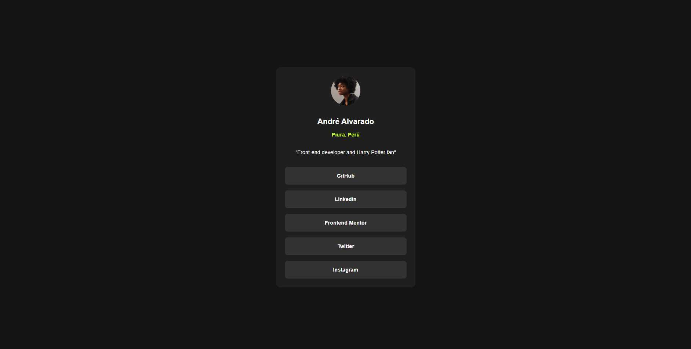

# Frontend Mentor - Social links profile solution

This is a solution to the [Social links profile challenge on Frontend Mentor](https://www.frontendmentor.io/challenges/social-links-profile-UG32l9m6dQ). Frontend Mentor challenges help you improve your coding skills by building realistic projects. 

## Table of contents

- [Overview](#overview)
  - [The challenge](#the-challenge)
  - [Screenshot](#screenshot)
  - [Links](#links)
- [My process](#my-process)
  - [Built with](#built-with)
  - [What I learned](#what-i-learned)
- [Author](#author)

## Overview

### The challenge

Users should be able to:

- See hover and focus states for all interactive elements on the page

### Screenshot




### Links

- Solution URL: [GitHub](https://github.com/TripCoder93/fm-social-links-profile)
- Live Site URL: [Add live site URL here](https://your-live-site-url.com)

## My process

### Built with

- Semantic HTML5 markup
- CSS custom properties
- Flexbox
- CSS Grid
- Mobile-first workflow
- [React](https://reactjs.org/) - JS library


### What I learned

I learn how to create a custom component for the button link in react and pass props and children.

I also use css modules for that custom component to isolate the styles used in it.

```typescript jsx
import './button-link.css';
import {FC, ReactNode} from "react";

type ButtonLinkProps = {
  url: string;
  children?: ReactNode;
}

const ButtonLink: FC<ButtonLinkProps> = ({children, url}) => {
  return (
          <a className="button-link" href={url}>
            {children}
          </a>
  );
}

export default ButtonLink;
```

## Author

- Website - [Andre](https://github.com/TripCoder93)
- Frontend Mentor - [@AndreCode2093](https://www.frontendmentor.io/profile/AndreCode2093)
